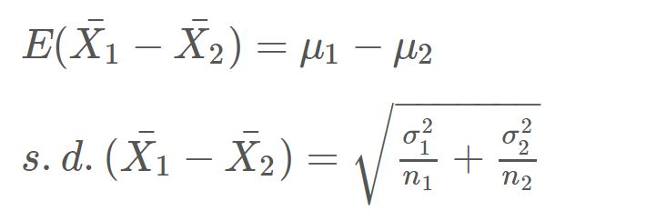
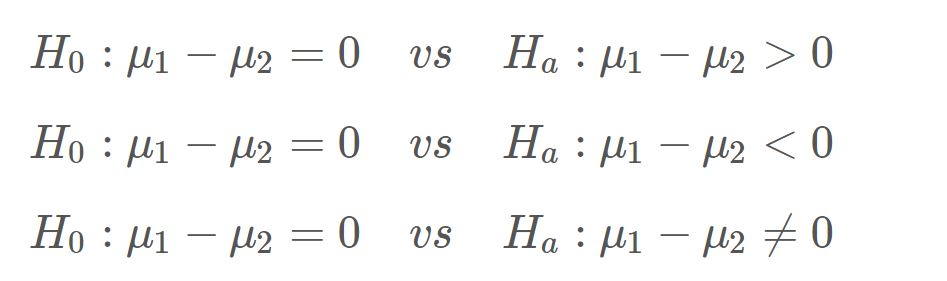
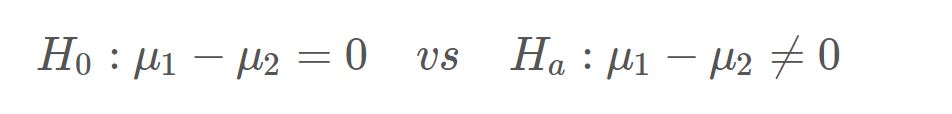

```{r setup, include = FALSE}
knitr::opts_chunk$set(echo = TRUE)
```

### Learning Objectives
1. Review the sampling distribution of the difference in two sample means
2. Carry out a hypothesis test for a difference in two population means
3. Estimate a difference in two population means with a confidence interval
4. Review helpful functions from Lab 4 and Lab 5


### Functions
1. `aggregate()`
2. `boxplot()`
3. `subset()`
4. `qqnorm()`
5. `qqline()`
6. `t.test()`
7. `table()`
8. `twoPopPropHT()`


***


## Statistical Review

### Sampling Distribution of Xbar1 - Xbar2

As we have seen many times this semester, the value of a statistic will vary from random sample to random sample. This week, our *statistic* is now a **difference in sample means** (or Xbar1 - Xbar2) and this will also vary from sample to sample. Because of this, we can create a sampling distribution for the difference in two (independent) sample means. We can quantify aspects of this sampling distribution, such as the center and spread. 

{width=300px}

We can use the above properties for *any* sample size! 

What can we say about the shape of this sampling distribution? 

If both of the populations are normally distributed (or if both of the sample sizes are large enough to use the CLT), then the sampling distribution for Xbar1 - Xbar2 is (approximately) normal.


***


## Coding Examples

### Data

Remember our `penguins` data set from the first few labs? We're going to use this data again today. But instead of the entire data set, we are only going to focus on the penguins living on Dream island, using a data set called `dream`.

```{r readDream}
dream <- read.csv("dream.csv")
```

A reminder of its contents.

```{r PreviewDream}
head(dream)
```

In today's lab, we will be comparing different measurements of the penguins on dream island *by group*. Namely, we will be analyzing:

- is there is a difference in average body mass by species (Adelie vs Chinstrap)
- is there is a difference in average flipper length by sex (male vs female) 


***


### Descriptive Comparison 

Whether we wish to construct a confidence interval or run a hypothesis test, it can be helpful to first calculate numerical summaries (by group) and visualize the data.

To calculate numerical summaries by group, we can utilize the `aggregate()` function (from Lab 2). Suppose we wish to calculate the average body mass *by species*. We would use the following code. 

```{r aggregate}
aggregate(body_mass_g ~ species, 
          data = dream, 
          FUN = mean)
```

As a reminder, we do not include the data set name (dream) with each of the variables. Instead, this function takes an additional argument called `data` and this is where we type in the name of the data set. The last argument (`FUN`) is short for "function". Input whichever numerical summary you wish to calculate (mean, median, sd, IQR, etc.).

**Demo #1:** Suppose we want to compare flipper length *by sex*. Calculate the interquartile range of flipper length by sex. Note: the function to calculate the interquartile range is `IQR` (all uppercase). 

```{r demo1, error = T}
# Replace this text with your code

```

Think About It: True or False? Because males have a larger IQR, our data suggests that male penguins (living on Dream island) have longer flippers, on average, than female penguins (living on Dream island).  


Let's visualize the comparison from Demo #1 using side-by-side boxplots. Using the `boxplot()` function (from Lab 2), we can compare the flipper lengths by sex. For this scenario, we have the following code.

```{r sideBysideBoxplot}
boxplot(dream$flipper_length_mm ~ dream$sex,
        xlab = "Sex",
        ylab = "Flipper Length (in mm)",
        main = "Boxplot of Flipper Length by Sex")
```

This plot suggests that, for penguins living on Dream island, male penguins have longer flippers, on average, than female penguins because...

- the median flipper length for males is higher than the median flipper length for females

- the *location* of the IQR for males is higher than the *location* of the IQR for females (both Q1 and Q3 are higher for males)

We will run a hypothesis test later on to assess this idea statistically. 


**Demo #2:** We also want to compare the average body mass of Adelie and Chinstrap penguins. Create a side-by-side boxplot of body mass *by species*. 

```{r demo2, error = T}
# Replace this text with your code

```

**Think-Pair-Share #1:** Suppose that before beginning the analysis, a researcher had hypothesized that Adelie penguins weigh more, on average, than Chinstrap penguins. 

Consider the following questions:

- Does the boxplot (created in Demo #2) support the researcher's claim? What about the sample means (calculated in the aggregate example)?
- If you were to run a hypothesis test to evaluate the researcher's claim, would you expect a small p-value or a large p-value? Why?

***

Potentially Helpful Tip: If a boxplot has *several* outliers, it can sometimes be difficult to read. In order to remove outliers from the plot, you can add the argument `outline = FALSE`. Your code would look like this:

```{r sideBysideBoxplot_OutliersRemoved}
boxplot(dream$flipper_length_mm ~ dream$sex,
        xlab = "Sex",
        ylab = "Flipper Length (in mm)",
        main = "Boxplot of Flipper Length by Sex \n with Outliers Removed",
        outline = FALSE)
```

If you choose to create the boxplot without outliers, you *must* note this in the title of the plot. Outliers still contain valuable information, but this adjustment can make the side-by-side boxplot easier to interpret in certain situations.

Note: because the original plot did not contain any outliers, the "updated" plot will look the same...but this is how you *would* code it. 


***


### Subsetting Data

While the `aggregate()` function allows us to calculate numerical summaries by group, we can't use this feature with QQ plots/histograms. Instead, we must split up our main data set into two smaller data sets - and then plot the data of each. This process helps us check the normality of each sample. 

Note: we will focus on the analysis of flipper length by sex (male vs female) in this section

The `subset()` function filters a data set based on a logical expression.

In order to check for normality, we need to split our dream data set into two data sets - one that includes only male penguins and one that includes only female penguins. To create the data set of male penguins, we would use the following code.

```{r subsetAdelie}
male <- subset(dream, sex == "male")
```

There are two things that you should note here:

1. We stored the results as a new data set named `male` 
2. We must use a double equals sign (==) in the logical expression  

We could use other logical expressions, but we will only be filtering the data based on a specific group. This is the only time we will need to use a double equals sign. 

To confirm that our data set includes only male penguins, click on your new data set in the top right window and have a look!

Note: the `subset()` function is very picky about spelling and lower/uppercase letters. If you don't get the results you expect, double check your spelling. 

**Demo #3:** Create a new data frame called `female` that includes only female penguins. Hint: remember the double equals sign and be careful with spelling and capitalization! 

```{r demo3, error = T}
# Replace this text with your code

```  

Your new `female` data set should contain 61 observations. (You can check in the top right window.) 


***


### Checking for Normality 

For the normality assumption regarding a difference in two population means, we have to create *two* histograms or *two* QQ plots - one for *each* sample of data. In the previous section, we learned how to subset the data to get these two independent samples of data.

Now that the data is split up by `sex`, we can create a QQ plot (or histogram) for *each* of the samples. Let's start with the male subset.

```{r qqplotAdelie}
qqnorm(male$flipper_length_mm, main = "QQ Plot of Flipper Lengths - Male")
qqline(male$flipper_length_mm)
```

Is it reasonable to assume that this sample of male flipper lengths was drawn from a normally distributed population of male flipper lengths? 

Yes! Our *sample* of male flipper lengths appears to follow a normal model because the points roughly follow along and around the line. Therefore, we can *assume* that this sample of male flipper lengths was drawn from a normally distributed *population* of male flipper lengths.

What about the flipper lengths of female penguins? 

**Demo #4:** Create the QQ plot of flipper lengths for the `female` subset (that you created in Demo #3). 

```{r demo4, error = T}
# Replace this text with your code

```

Think About It: Is it reasonable to assume that this sample of female flipper lengths was drawn from a normally distributed population of female flipper lengths? 


***


### Hypothesis Testing

A hypothesis test helps us judge whether or not a statement about a population is reasonable or not. The procedure for running any hypothesis test involves four steps:

1. Determine appropriate null and alternative hypotheses 
2. Check the assumptions for performing the test  
3. Calculate the observed sample proportion and the test statistic. Then, determine the p-value.
4. First, evaluate the p-value and determine the amount of evidence against the null hypothesis. Then, make a conclusion in the context of the problem.

Our parameter of interest is now the difference in two population means, mu1 - mu2. When setting up the hypotheses, we have three options.

{width=400px}

Suppose we wish to assess if there is a *difference* in the population mean flipper length between male penguins and female penguins (living on Dream island).

{width=400px}

To run the hypothesis test, we will once again utilize the `t.test()` function. 

```{r HTtwoMeans}
t.test(dream$flipper_length_mm ~ dream$sex,
       mu = 0,
       alternative = "two.sided")
```

We have three arguments to specify:

- variables: **quantitative by categorical**
- `mu`: hypothesized value of mu1 - mu2 (typically 0)
- `alternative`: direction in Ha ("less", "greater", or "two.sided")

From the output we get the observed t-test statistic (-5.1754), the degrees of freedom for the null distribution (115.82) and the corresponding p-value (9.667e-07 or approximately 0.0000009667). 

**Evaluation:** With a p-value of 0.0000009667, there is *very strong* evidence against the null hypothesis and in support of the alternative hypothesis. 

**Conclusion:** Based on this sample data, there is *very strong* evidence to suggest that the population mean flipper length of all male penguins (living on Dream island) is *different* than the population mean flipper length of all female penguins (living on Dream island).


**Think-Pair-Share #2:** The output above also provides us with a 95% confidence interval for the difference in the population mean flipper length: (-8.6973 mm, -3.8828 mm).  

Based on the output, consider the following questions:

- Do male penguins or female penguins have longer flippers, on average? How can you tell from the output?
- The interval estimates mu1 - mu2. What does mu1 represent? How did R pick this sex as group 1? 


**Demo #5:** Assess if the population mean body mass of all Adelie penguins is greater than the population mean body mass of all Chinstrap penguins. We will assume that all assumptions have been met to run the hypothesis test. Remember to consider which species will be chosen by R as Group 1.  

```{r demo5, error = T}
# Replace this text with your code

```

Think About It: How you would write an evaluation and a conclusion based on this output? Do these results match what you saw from the side-by-side boxplots back in Demo #2?


***


### Additional Functions 

#### Two Population Proportions 

If you wish to run a *hypothesis test* for the difference in two population proportions, you can utilize the following user-created function, `twoPopPropHT()`. 

Example: We wish to assess if the proportion of female penguins among all Adelie living on Dream island is less than the proportion of female penguins among all Chinstrap living on Dream island.  

H0: p_1 - p_2 = 0 vs Ha: p_1-p_2 < 0


Where p_1 represents the population proportion of Adelie penguins living on Dream island who are females  and p_2 represents the population proportion of Chinstrap penguins living on Dream island who are females. 

In order to run this test, we could use the `twoPopPropHT()` function from the `stats250package` package. Let's load in the package. 

```{r loadPackage}
library(stats250package)
```

The `twoPopPropHT()` function takes the following arguments:

1. `x1`: number of "successes" for group 1
2. `n1`: sample size of group 1
3. `x2`: number of "successes" for group 2
4. `n2`: sample size of group 2
5. `alt`: alternative hypothesis ("less", "greater", or "two.sided") 

In order to find the values of `x1`, `x2`, `n1`, and `n2`, we need to use the `table()` function (from Lab 1). 

```{r tableExample}
addmargins(table(dream$sex,dream$species))
```

Let's summarize the data from this table: 

- Group 1 (Adeline Penguins): We see that there are 27 female penguins in our sample of 55 Adelie penguins. So `x1` is 27 and `n1` is 55. 
- Group 2 (Chinstrap Penguins): We see that there are 34 female penguins in our sample of 68 Chinstrap penguins. So `x2` is 34 and `n2` is 68. 

We can now use the `twoPopPropHT()` function.

```{r twoPopPropHTExample}
twoPopPropHT(x1 = 27, n1 = 55, x2 = 34, n2 = 68, alt = "less")
```

**Evaluation:** With a p-value of 0.460, there is not enough evidence against the null hypothesis and in support of the alternative. 

**Conclusion:** Based on the data, we do not have enough evidence to suggest that proportion of all female Adeline penguins living on Dream island is less than the proportion of all female Chinstrap penguins living on Dream island.


#### One Population Mean

Suppose we wanted to estimate the population mean body mass of penguins living on Dream island. If we were to create a 95% confidence interval to estimate this parameter, we would use the following code:

```{r onePopMeanCIExample}
t.test(dream$body_mass_g, conf.level = 0.95)
```

Interpretation of the Confidence **Interval**: We are 95% confident that the population mean body mass of penguins living on Dream island lies between 3645.196 grams and 3792.609 grams. 

